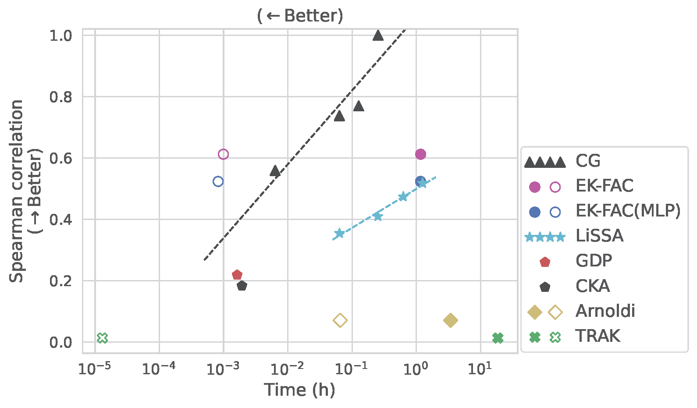

# Scalable Multi-Stage Influence Function for LLMs

Code for ["Scalable Multi-Stage Influence Function for Large Language Models via Eigenvalue-Corrected Kronecker-Factored Parameterization"](https://arxiv.org/abs/2505.05017) (accepted to IJCAI 2025).


## What is "multi-stage" influence?
Pretrained foundational LLMs are often unusable out-of-the-box and require additional fine-tuning, which typically involves fine-tuning on downstream tasks:

```
        +-------------------------------------------------------------------------------------+
        |                                                                                     |
        |                                                                                     V
[Pretraining data] --> [Pretrained base] --> [Fine-tuned model] -------> [x="This product is great!", y=<positive>]
    (~T tokens)                  ^                                                            ^
                                 |                                                            |
                        [Task-specific data] -------------------------------------------------+
                            (~M tokens)
```

which is a "two-stage" scenario. The multi-stage influence corresponds to estimating the influence of pretraining data on an instance (with both input & output) of the downstream task, e.g. instruction following, sentiment classification.


## Why not single-stage influence?
1. Multi-stage influence function comes into play in failure cases of single-stage influence functions.

    When the downstream fine-tuning task operates in the same domain as the pretraining task, single-stage influence function is still valid. For example, when a Llama model is fine-tuned to better follow instructions according to a chat template.

    Single-stage influence function is no longer valid when the downstream task is fundamentally different from the pretraining task.
For example, we may fine-tune a Llama model for a binary sentiment classification task, which requires replacing the final prediction layer.
This is when we fail to obtain sample losses (usually autoregressive cross-entropy loss) on pretraining samples (token sequences) directly from the fine-tuned model.

2. Multi-stage influence is also motivated by the fact that the major proportion of factual knowledge is learned during the pretraining process rather than the fine-tuning process.

    Single-stage influence informs us of how the model learns to solve a specific task, but fails to tell us how the model utilizes its foundational knowledge.

3. Multi-stage influence function offers better influence estimates than single-stage influence function, as is shown empircally.


## What this repo offers
1. General utility to compute influence functions for autoregressive decoder-only LLMs.
2. Replication of "influence estimation v.s. computational cost" for multi-stage influence function and other training data attribution techniques (e.g., single-stage influence function, gradient dot product, representation similarity).
3. Demonstration of multi-stage influence for factual knowledge retrieval.


## Highlights
* Better trade-offs:

    Influence functions via EK-FAC parameterization are able to achieve better trade-offs between **data influence estimation quality** and **pair-wise runtime** (influence of a training sample on a test instance):

    

* Scalable for LLMs:

    Tractable multi-stage influence for LLMs as large as 3 billion parameters (dolly-v2-3b).


## Code for result replication
We provide code for replication of the results in our paper in `replication/`, with details on setting up the environment.

Hardware: A single A800 (80 GB) GPU suffices for most of our experiments, where the largest off-the-shelf models are bloom(z)-560m. For the dolly-v2-3b model, two A800 GPUs are needed.
